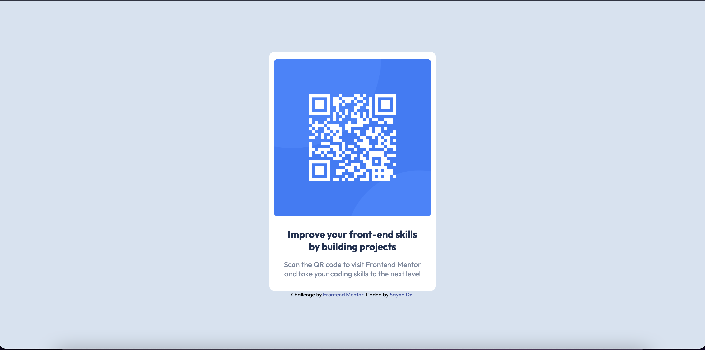

# Frontend Mentor - QR code component solution

This is a solution to the [QR code component challenge on Frontend Mentor](https://www.frontendmentor.io/challenges/qr-code-component-iux_sIO_H). Frontend Mentor challenges help you improve your coding skills by building realistic projects. 

## Table of contents

- [Overview](#overview)
  - [Screenshot](#screenshot)
  - [Links](#links)
- [My process](#my-process)
  - [Built with](#built-with)
  - [What I learned](#what-i-learned)
  - [Useful resources](#useful-resources)
- [Author](#author)

## Overview

### Screenshot

### Links

- Solution URL: [https://www.frontendmentor.io/solutions/responsive-qr-code-component-rJQzAiMZj]
- Live Site URL: [https://roosterroo.github.io/QRCodeFrontEnd/]

## My process

### Built with

- Semantic HTML5 markup
- CSS custom properties
- Flexbox

### What I learned

### Useful resources

- [Scrimba](https://scrimba.com/dashboard?tab=overview) - This helped me with the basics of HTML and CSS.
- [Kevin Powell's Youtube channel](https://www.youtube.com/kepowob) - I have always been afraid of messing up when it's time to write CSS stylings but Kevin's videos helped a lot.

## Author

- Frontend Mentor - [@RoosterRoo](frontendmentor.io/profile/RoosterRoo)

